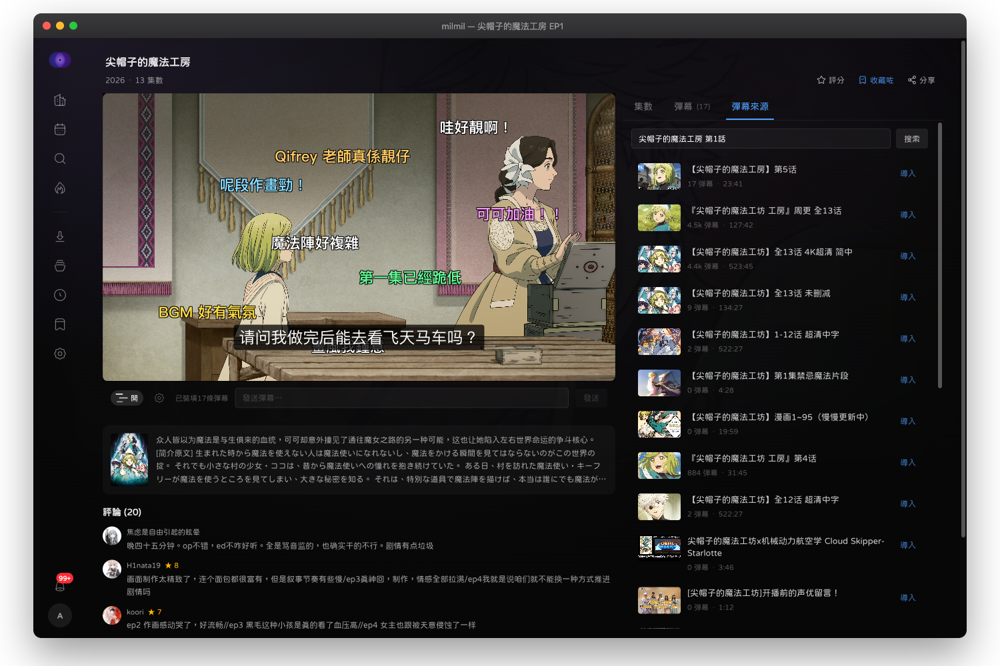

<p align="center">
  
</p>

<h1 align="center">milmil</h1>

<p align="center">
  セルフホスト型アニメメディアサーバー<br/>
  <sub>メディアライブラリ管理、新番カレンダー、トレンドアニメ、弾幕再生</sub>
</p>

<p align="center">
  <a href="README.en.md">English</a> | 日本語 | <a href="README.ko.md">한국어</a> | <a href="README.zh-CN.md">简体中文</a> | <a href="README.zh-TW.md">繁體中文（台灣）</a> | <a href="README.md">粵語</a>
</p>

<p align="center">
  <a href="#機能">機能</a> &bull;
  <a href="#スクリーンショット">スクリーンショット</a> &bull;
  <a href="#クイックスタート">クイックスタート</a> &bull;
  <a href="#デプロイ">デプロイ</a> &bull;
  <a href="#設定">設定</a> &bull;
  <a href="#開発">開発</a> &bull;
  <a href="#ライセンス">ライセンス</a>
</p>

---

## スクリーンショット

<p align="center">
  
</p>

<p align="center">
  
</p>

<p align="center">
  
</p>

<p align="center">
  
</p>

<p align="center">
  
</p>

---

## 機能

### ライブラリ管理
- **マルチソースストレージ** — ローカルファイルシステム、SMB、SFTP、rclone経由で40以上のクラウドバックエンド
- **自動スキャン** — FFmpegメタデータ抽出付きの設定可能なスキャン間隔
- **ファイルマッチング** — マルチプロバイダーアニメ識別（DandanPlayハッシュ、Bangumi、TMDB、AniList）
- **エピソード解析** — 複数ソースからのエピソードメタデータ自動エンリッチメント

### ディスカバー
- **新番カレンダー** — 曜日別の新作アニメ
- **トレンド** — Bangumiの人気アニメランキング
- **検索** — アニメデータベース横断の全文検索
- **ジャンル・タグブラウズ** — ジャンル、年、シーズン、フォーマット、スコアでフィルタリング

### 再生
- **ダイレクトストリーミング** — 互換フォーマットのbyte-rangeリクエスト
- **コンテナリマックス** — トランスコードなしでMKVからMP4へ
- **HLSトランスコード** — FFmpegベースのアダプティブストリーミング（セッションキャッシュ付き）
- **弾幕** — DandanPlayからの弾幕コメントオーバーレイ
- **字幕サポート** — 埋め込みおよび外部字幕トラック
- **視聴進捗** — 位置の自動保存とレジューム
- **外部プレーヤーサポート** — Jellyfin互換APIでInfuse、VLC、Kodi、mpvに接続、LAN自動検出対応

### ダウンロード
- **内蔵torrentクライアント** — anacrolix/torrent（設定可能なシード）
- **HTTPダウンロード** — レジューム対応のダイレクトファイルダウンロード
- **RSS自動ダウンロード** — 正規表現フィルター、解像度/字幕グループ指定でアニメを購読
- **トレント検索** — Nyaa、DMHY、Mikan、Bangumi.moe、ACG.ripの横断検索
- **ダウンロード後パイプライン** — 完了後の自動スキャン、マッチング、解析

### コレクション
- **視聴状態** — 計画中、視聴中、完了、一時停止、中断
- **ユーザー評価** — 個人評価システム
- **最近の履歴** — 前回の続きから視聴
- **Bangumi & AniList同期** — OAuthベースのリスト同期

### システム
- **PWA** — オフラインサポート付きインストール可能なプログレッシブウェブアプリ
- **i18n** — 英語、日本語、韓国語、簡体字中国語、繁体字中国語（台湾/香港）
- **通知** — WebSocketベースのリアルタイムプッシュ（ダウンロード/スキャンイベント）
- **二要素認証** — TOTPベースの2FA
- **設定エクスポート/インポート** — 完全な設定バックアップ

---

## 技術スタック

| レイヤー | テクノロジー |
|----------|-------------|
| バックエンド | Go 1.27, Echo v5, SQLite / PostgreSQL |
| フロントエンド | React 19, TanStack Router, Tailwind CSS v4 |
| 状態管理 | Zustand (UI), TanStack Query (サーバー) |
| バンドラー | Vite 8, Bun |
| スタイリング | Tailwind CSS v4, shadcn/ui, Hugeicons |
| アニメーション | Motion (Framer Motion) |
| i18n | Lingui v5 |
| ビデオ | Video.js, FFmpeg |
| PWA | Serwist |
| キャッシュ | Redis（オプション、インメモリフォールバック） |
| テスト | Vitest, Playwright, Go testing |
| リンティング | Vite+ (Oxlint/Oxfmt), Lefthook, Commitlint |

---

## クイックスタート

### 前提条件

- Go 1.27+
- Bun 1.3+
- FFmpeg（トランスコードとメディア情報用）
- Redis（オプション）

### 開発モード

```bash
# ツールのインストール
make setup

# API + フロントエンドをホットリロードで起動
make dev
```

APIは `http://localhost:8080`、フロントエンドは `http://localhost:5173` で起動します。

### Docker

```bash
# 公開イメージを使用（API + Web + Redis、SQLiteで起動）
docker compose up -d

# Postgresを使う場合（オプトイン）
docker compose --profile postgres up -d

# ローカルコードからビルド
docker compose -f docker-compose.yml -f docker-compose.dev.yml up -d --build
```

---

## デプロイ

### Docker Compose（本番環境）

```bash
# 環境変数ファイルをコピーして編集
cp .env.example .env
cp api/.env.example api/.env  # JWT_SECRETやREDISの認証情報を設定

# Docker Hubの公開イメージで起動（milmildev/milmil-api、milmildev/milmil-web）
docker compose up -d
```

**サービス：**
- **PostgreSQL 16** — データベース
- **Redis 7** — キャッシュ
- **milmil-api** — Goバックエンド（ポート8080）
- **milmil-web** — Reactフロントエンド（Nginx経由、ポート3000）

### リバースプロキシ

HTTPS用にNginxまたはCaddyの後ろに配置：

```nginx
server {
    listen 443 ssl;
    server_name anime.example.com;

    location / {
        proxy_pass http://localhost:3000;
    }

    location /api/ {
        proxy_pass http://localhost:8080;
        proxy_set_header Upgrade $http_upgrade;
        proxy_set_header Connection "upgrade";
    }

    location /ws {
        proxy_pass http://localhost:8080;
        proxy_set_header Upgrade $http_upgrade;
        proxy_set_header Connection "upgrade";
    }
}
```

---

## 設定

### 環境変数

| 変数 | デフォルト | 説明 |
|------|-----------|------|
| `DATABASE_URL` | `sqlite://data/milmil.db` | データベース接続文字列 |
| `REDIS_URL` | — | Redis URL（開発時はオプション） |
| `JWT_SECRET` | — | JWT署名キー（32文字以上、必須） |
| `MILMIL_ENCRYPTION_KEY` | — | ストレージ認証情報用AES-256キー |
| `API_PORT` | `8080` | APIサーバーポート |
| `DATA_DIR` | `./data` | ダウンロードとトランスコードキャッシュ |
| `TORRENT_LISTEN_PORT` | `42069` | Torrent DHT/peerポート |
| `SEED_RATIO` | `1.0` | Torrentシード比率目標 |
| `SEED_TIME_MINUTES` | `60` | Torrentシード時間 |
| `DANDANPLAY_APP_ID` | — | DandanPlay API認証情報 |
| `DANDANPLAY_APP_SECRET` | — | DandanPlay API認証情報 |
| `DEBUG` | `0` | デバッグログの有効化 |

### 外部連携（オプション）

| サービス | 用途 | 設定 |
|----------|------|------|
| **Bangumi** | アニメメタデータ、OAuth同期 | 設定 > 連携 |
| **AniList** | 代替メタデータソース、OAuth同期 | 設定 > 連携 |
| **DandanPlay** | ファイルマッチング、弾幕コメント | 環境変数または設定画面 |
| **TMDB** | TV番組クロスリファレンス | 設定 > 連携 |

---

## 開発

### プロジェクト構成

```
milmil/
  api/                    # Goバックエンド
    cmd/server/           # エントリーポイント
    internal/
      api/                # HTTPハンドラー + ルーター
      auth/               # JWT + 2FA
      cache/              # Redis / インメモリ
      config/             # 環境設定
      db/                 # データベースセットアップ + マイグレーション
      downloader/         # Torrent + HTTPエンジン
      ffmpeg/             # トランスコード
      integration/        # Bangumi, AniList, DandanPlay, TMDB
      matcher/            # マルチプロバイダーアニメマッチャー
      metadata/           # メタデータエンリッチメント
      notification/       # イベント通知
      resolver/           # エピソードリゾルバー
      rss/                # RSSフィードパーサー
      scanner/            # ライブラリファイルスキャナー
      storage/            # SMB/SFTP/ローカルプロバイダー
      store/              # SQLc生成クエリ
      torrent/            # トレント検索プロバイダー
      worker/             # バックグラウンドジョブ
      ws/                 # WebSocket hub
    migrations/           # SQLマイグレーション
  web/                    # Reactフロントエンド
    src/
      components/         # UIコンポーネント
      hooks/              # カスタムフック
      lib/                # APIクライアント、ユーティリティ
      locales/            # i18n翻訳（6言語）
      pages/              # ページコンポーネント
      routes/             # TanStack Router定義
      store/              # Zustand stores
      styles/             # グローバルCSS + テーマ
    e2e/                  # Playwrightテスト
```

### コマンド

```bash
# 開発
make dev              # 両サーバーをホットリロードで起動
make dev-api          # APIのみ（air使用）
make dev-web          # フロントエンドのみ（Vite使用）

# ビルド
make build            # 本番フロントエンドビルド

# テスト
make test             # 全テスト実行（Go + フロントエンド）
cd web && bun run test:run      # フロントエンド単体テスト
cd web && bun run test:e2e      # Playwright E2Eテスト

# 品質
make lint             # Go vet + vp lint (Oxlint)
cd web && bun run check:all     # 型チェック + lint + フォーマット + テスト

# i18n
cd web && bun run i18n:extract  # 翻訳文字列の抽出
cd web && bun run i18n:compile  # 翻訳のコンパイル
```

### データベース

- **開発：** SQLite（ゼロ設定）
- **本番：** PostgreSQL 16+
- **マイグレーション：** golang-migrateで起動時に自動適用
- **クエリ：** SQLファースト、sqlcによるコード生成

---

## 対応言語

- English
- 日本語 (ja)
- 한국어 (ko)
- 简体中文 (zh-CN)
- 繁體中文 — 台灣 (zh-TW)
- 繁體中文 — 香港 (zh-HK)

---

## Star History

<a href="https://star-history.com/#milmil-dev/milmil&Date">
 <picture>
   <source media="(prefers-color-scheme: dark)" srcset="https://api.star-history.com/svg?repos=milmil-dev/milmil&type=Date&theme=dark" />
   <source media="(prefers-color-scheme: light)" srcset="https://api.star-history.com/svg?repos=milmil-dev/milmil&type=Date" />
   
 </picture>
</a>

---

## ライセンス

milmilは [GNU Affero General Public License v3.0](LICENSE) の下でライセンスされています。

これは、milmilを自由に使用、変更、配布できることを意味しますが、変更したバージョンをネットワークサービスとして実行する場合は、そのサービスのユーザーにソースコードを提供する必要があります。
