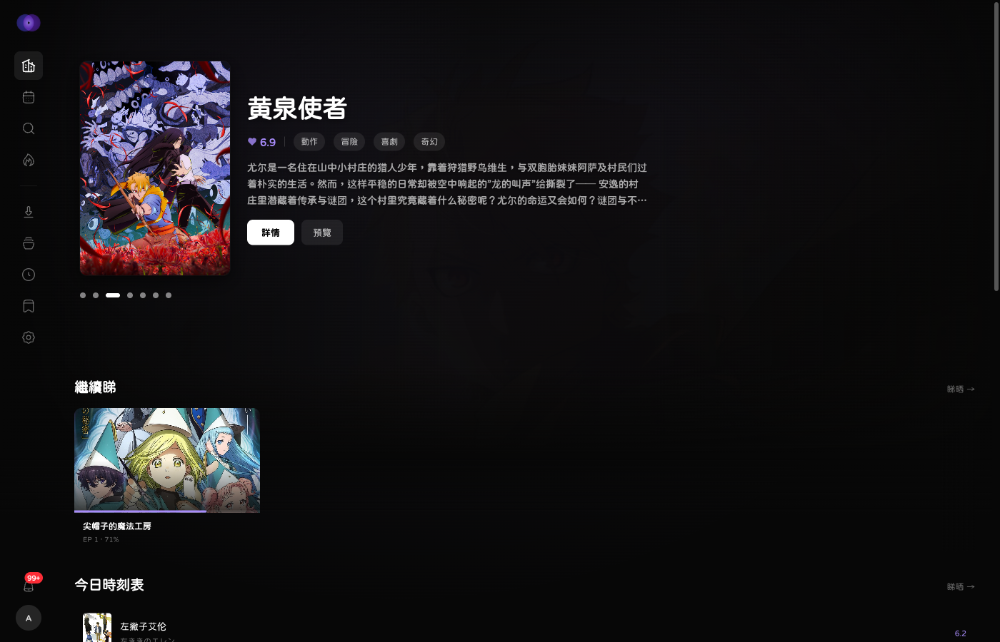
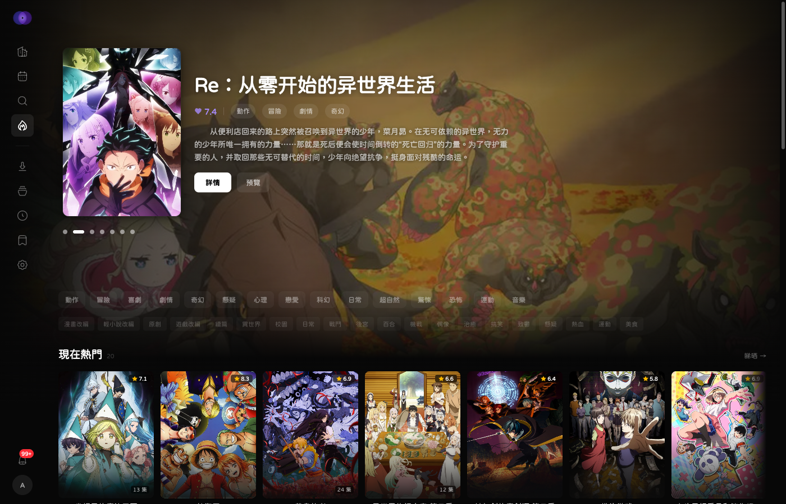
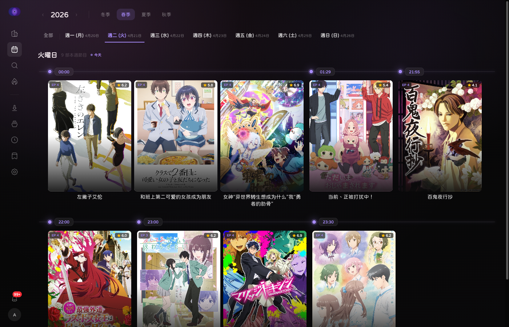
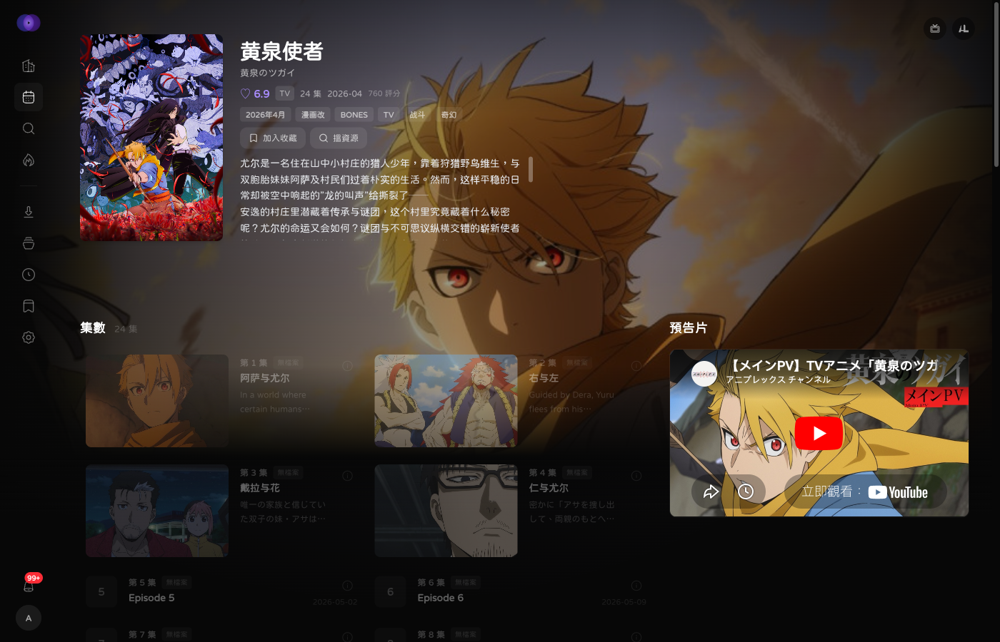

<p align="center">
  
</p>

<h1 align="center">milmil</h1>

<p align="center">
  自架動畫媒體伺服器<br/>
  <sub>媒體庫管理、新番日曆、動畫趨勢、彈幕播放</sub>
</p>

<p align="center">
  <a href="README.en.md">English</a> | <a href="README.ja.md">日本語</a> | <a href="README.ko.md">한국어</a> | <a href="README.zh-CN.md">简体中文</a> | 繁體中文（台灣） | <a href="README.md">繁體中文（香港）</a>
</p>

<p align="center">
  <a href="#功能特色">功能特色</a> &bull;
  <a href="#截圖預覽">截圖預覽</a> &bull;
  <a href="#快速開始">快速開始</a> &bull;
  <a href="#部署">部署</a> &bull;
  <a href="#設定">設定</a> &bull;
  <a href="#開發">開發</a> &bull;
  <a href="#授權條款">授權條款</a>
</p>

---

## 截圖預覽

<p align="center">
  
</p>

<p align="center">
  
</p>

<p align="center">
  
</p>

<p align="center">
  
</p>

---

## 功能特色

### 媒體庫管理
- **多來源儲存** — 本地檔案系統、SMB、SFTP，以及透過 rclone 支援 40+ 雲端後端
- **自動掃描** — 可設定掃描間隔，搭配 FFmpeg 擷取媒體中繼資料
- **檔案比對** — 多來源動畫辨識（DandanPlay 雜湊、Bangumi、TMDB、AniList）
- **集數解析** — 自動從多個來源豐富集數中繼資料

### 探索
- **新番日曆** — 按星期排列新番動畫
- **趨勢排行** — 來自 Bangumi 的人氣動畫排名
- **搜尋** — 跨動畫資料庫全文搜尋
- **類型與標籤瀏覽** — 按類型、年份、季度、格式和評分篩選

### 播放
- **直接串流** — 相容格式的 byte-range 請求
- **容器重新封裝** — MKV 轉 MP4，無需轉碼
- **HLS 轉碼** — 基於 FFmpeg 的自適應串流，支援 session 快取
- **彈幕** — 來自 DandanPlay 的彈幕留言覆蓋層
- **字幕支援** — 內嵌及外掛字幕軌
- **觀看進度** — 自動儲存位置及續播
- **外部播放器支援** — 透過 Jellyfin 相容 API 連接 Infuse、VLC、Kodi、mpv，支援 LAN 自動探索

### 下載
- **內建 torrent 用戶端** — 基於 anacrolix/torrent，可設定做種
- **HTTP 下載** — 直接檔案下載，支援中斷續傳
- **RSS 自動下載** — 訂閱動畫，支援正規表示式篩選、解析度/字幕組偏好
- **種子搜尋** — 聚合搜尋 Nyaa、DMHY、Mikan、Bangumi.moe、ACG.rip
- **下載後流程** — 完成後自動掃描、比對、解析

### 收藏
- **觀看狀態** — 想看、在看、看過、擱置、拋棄
- **使用者評分** — 個人評分系統
- **最近紀錄** — 從上次離開的地方繼續觀看
- **Bangumi 及 AniList 同步** — 基於 OAuth 的清單同步

### 系統
- **PWA** — 可安裝的漸進式網頁應用程式，支援離線
- **國際化** — 英文、日文、韓文、簡體中文、繁體中文（台灣/香港）
- **通知** — 基於 WebSocket 的即時推播（下載/掃描事件）
- **雙重驗證** — 基於 TOTP 的 2FA
- **設定匯出/匯入** — 完整組態備份

---

## 技術堆疊

| 層級 | 技術 |
|------|------|
| 後端 | Go 1.26, Echo v4, SQLite / PostgreSQL |
| 前端 | React 19, TanStack Router, Tailwind CSS v4 |
| 狀態 | Zustand (UI), TanStack Query (伺服器) |
| 打包 | Vite 8, Bun |
| 樣式 | Tailwind CSS v4, shadcn/ui, Hugeicons |
| 動畫 | Motion (Framer Motion) |
| 國際化 | Lingui v5 |
| 影片 | Video.js, FFmpeg |
| PWA | Serwist |
| 快取 | Redis（選用，記憶體回退） |
| 測試 | Vitest, Playwright, Go testing |
| 程式碼品質 | Biome, Lefthook, Commitlint |

---

## 快速開始

### 前置需求

- Go 1.26+
- Bun 1.3+
- FFmpeg（用於轉碼及媒體資訊）
- Redis（選用）

### 開發模式

```bash
# 安裝工具
make setup

# 啟動 API + 前端（熱重載）
make dev
```

API 執行於 `http://localhost:8080`，前端執行於 `http://localhost:5173`。

### Docker

```bash
docker-compose up -d
```

---

## 部署

### Docker Compose（正式環境）

```bash
# 複製並編輯環境變數檔案
cp .env.example .env

# 啟動所有服務
docker-compose -f docker-compose.prod.yml up -d
```

**服務：**
- **PostgreSQL 16** — 資料庫
- **Redis 7** — 快取
- **milmil-api** — Go 後端（port 8080）
- **milmil-web** — React 前端，透過 Nginx（port 3000）

### 反向代理

建議使用 Nginx 或 Caddy 加上 HTTPS：

```nginx
server {
    listen 443 ssl;
    server_name anime.example.com;

    location / {
        proxy_pass http://localhost:3000;
    }

    location /api/ {
        proxy_pass http://localhost:8080;
        proxy_set_header Upgrade $http_upgrade;
        proxy_set_header Connection "upgrade";
    }

    location /ws {
        proxy_pass http://localhost:8080;
        proxy_set_header Upgrade $http_upgrade;
        proxy_set_header Connection "upgrade";
    }
}
```

---

## 設定

### 環境變數

| 變數 | 預設值 | 說明 |
|------|--------|------|
| `DATABASE_URL` | `sqlite://data/milmil.db` | 資料庫連線字串 |
| `REDIS_URL` | — | Redis URL（開發環境選用） |
| `JWT_SECRET` | — | JWT 簽章金鑰（最少 32 字元，必填） |
| `MILMIL_ENCRYPTION_KEY` | — | AES-256 金鑰，用於加密儲存憑證 |
| `API_PORT` | `8080` | API 伺服器埠 |
| `DATA_DIR` | `./data` | 下載及轉碼快取目錄 |
| `TORRENT_LISTEN_PORT` | `42069` | Torrent DHT/peer 埠 |
| `SEED_RATIO` | `1.0` | Torrent 做種比率目標 |
| `SEED_TIME_MINUTES` | `60` | Torrent 做種時長 |
| `DANDANPLAY_APP_ID` | — | DandanPlay API 憑證 |
| `DANDANPLAY_APP_SECRET` | — | DandanPlay API 憑證 |
| `DEBUG` | `0` | 啟用除錯紀錄 |

### 外部整合（選用）

| 服務 | 用途 | 設定 |
|------|------|------|
| **Bangumi** | 動畫中繼資料、OAuth 同步 | 設定 > 整合 |
| **AniList** | 替代中繼資料來源、OAuth 同步 | 設定 > 整合 |
| **DandanPlay** | 檔案比對、彈幕留言 | 環境變數或設定頁面 |
| **TMDB** | TV 節目交叉參照 | 設定 > 整合 |

---

## 開發

### 專案結構

```
milmil/
  api/                    # Go 後端
    cmd/server/           # 進入點
    internal/
      api/                # HTTP 處理器 + 路由
      auth/               # JWT + 2FA
      cache/              # Redis / 記憶體快取
      config/             # 環境組態
      db/                 # 資料庫設定 + 遷移
      downloader/         # Torrent + HTTP 引擎
      ffmpeg/             # 轉碼
      integration/        # Bangumi, AniList, DandanPlay, TMDB
      matcher/            # 多來源動畫比對器
      metadata/           # 中繼資料豐富化
      notification/       # 事件通知
      resolver/           # 集數解析器
      rss/                # RSS 訂閱解析
      scanner/            # 媒體庫檔案掃描器
      storage/            # SMB/SFTP/本地儲存提供者
      store/              # SQLc 產生查詢
      torrent/            # 種子搜尋提供者
      worker/             # 背景工作
      ws/                 # WebSocket hub
    migrations/           # SQL 遷移
  web/                    # React 前端
    src/
      components/         # UI 元件
      hooks/              # 自訂 hooks
      lib/                # API 用戶端、工具函式
      locales/            # 國際化翻譯（6 種語言）
      pages/              # 頁面元件
      routes/             # TanStack Router 定義
      store/              # Zustand stores
      styles/             # 全域 CSS + 主題
    e2e/                  # Playwright 測試
```

### 指令

```bash
# 開發
make dev              # 啟動雙伺服器（熱重載）
make dev-api          # 僅 API（使用 air）
make dev-web          # 僅前端（使用 Vite）

# 建置
make build            # 正式環境前端建置

# 測試
make test             # 執行所有測試（Go + 前端）
cd web && bun run test:run      # 前端單元測試
cd web && bun run test:e2e      # Playwright E2E 測試

# 品質
make lint             # Go vet + Biome lint
cd web && bun run check:all     # 型別檢查 + lint + 格式化 + 測試

# 國際化
cd web && bun run i18n:extract  # 擷取翻譯字串
cd web && bun run i18n:compile  # 編譯翻譯
```

### 資料庫

- **開發：** SQLite（零設定）
- **正式：** PostgreSQL 16+
- **遷移：** 啟動時自動套用，使用 golang-migrate
- **查詢：** SQL-first，使用 sqlc 程式碼產生

---

## 支援語言

- English
- 日本語 (ja)
- 한국어 (ko)
- 简体中文 (zh-CN)
- 繁體中文 — 台灣 (zh-TW)
- 繁體中文 — 香港 (zh-HK)

---

## Star History

<a href="https://star-history.com/#milmil-dev/milmil&Date">
 <picture>
   <source media="(prefers-color-scheme: dark)" srcset="https://api.star-history.com/svg?repos=milmil-dev/milmil&type=Date&theme=dark" />
   <source media="(prefers-color-scheme: light)" srcset="https://api.star-history.com/svg?repos=milmil-dev/milmil&type=Date" />
   
 </picture>
</a>

---

## 授權條款

milmil 採用 [GNU Affero General Public License v3.0](LICENSE) 授權。

這表示您可以自由使用、修改及散布 milmil，但若您將修改版本作為網路服務執行，您必須向該服務的使用者提供原始碼。
